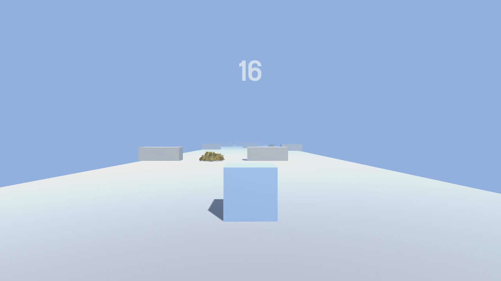

# Notes
I'm also very well aware of the similarity to Brackey's.
I'm still learning Unity 3D and would implement more changes soon. Will take down upon request.

# Run Cube, Run! (Inspired by Brackeys)
<b>Description:</b> 
Learning from Brackeys, this game sets out to challenge you to complete levels after levels of dodging blocks! Will you be able to make it to the end?  
<b>Controls:</b> 
WASD: FORWARD/BACKWARD/LEFT/RIGHT 

# Game Screenshots
<b>Screenshot1</b> 
 
<b>Screenshot2</b> 
 
<b>Screenshot3</b> 
 

# Video Sample
https://youtu.be/3jvmqdqA5rk

# Credits:
# Directed by
Faliq Aldy Tan

# Special Thanks 
Brackeys for giving me inspiration on making this Unity 3D game. 

# Legal: I do not own any of the assets used in this project.
# Will take down upon request
